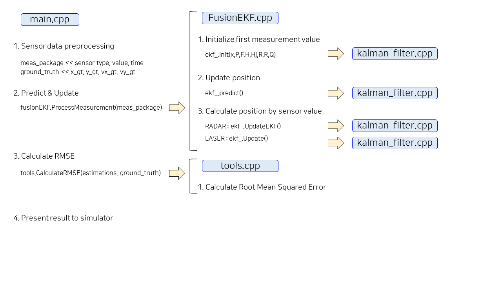
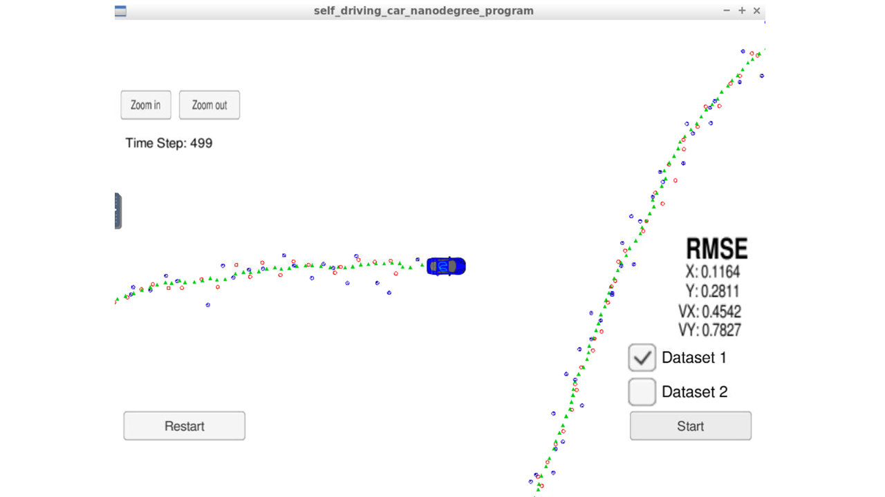

# SELF DRIVING CAR NANODEGREE
# project5. Extended Kalman Filter


[//]: # (Image References)

[image1-1]: ./images/laser_radar.png "raser and radar characterastics"

[image2-1]: ./images/kalman_filter_1.jpg "About Kalman Filter"
[image2-2]: ./images/kalman_filter_2.jpg "About Kalman Filter"
[image2-3]: ./images/kalman_filter_3.jpg "About Kalman Filter"
[image2-4]: ./images/kalman_filter_4.jpg "About Kalman Filter"
[image2-5]: ./images/kalman_filter_5.jpg "About Kalman Filter"

[image3-1]: ./images/extended_kalman_filter_1.jpg "About Extended Kalman Filter"
[image3-2]: ./images/extended_kalman_filter_2.jpg "About Extended Kalman Filter"
[image3-3]: ./images/extended_kalman_filter_3.jpg "About Extended Kalman Filter"
[image3-4]: ./images/extended_kalman_filter_4.jpg "About Extended Kalman Filter"
[image3-5]: ./images/extended_kalman_filter_5.jpg "About Extended Kalman Filter"
[image3-6]: ./images/extended_kalman_filter_6.jpg "About Extended Kalman Filter"
[image3-7]: ./images/extended_kalman_filter_7.jpg "About Extended Kalman Filter"
[image3-8]: ./images/extended_kalman_filter_8.jpg "About Extended Kalman Filter"
[image3-9]: ./images/extended_kalman_filter_9.jpg "About Extended Kalman Filter"

[image4-1]: ./images/code_flow.png "Code Flow"

[image5-1]: ./images/result.png "Result"


## 1. Abstraction

The object of this project is to detect bicycle around me (supposing I am driving) by implementing Extended Kalman Filter with C++ 

Red circle is sensor data from Lidar,

Blue circle is sensor data from Radar,

Green triangle is result of calculation that predict its position & direction

Object of this project is predict bicycle's position by using Extended Kalman Filter

and its RMSE should be under [.11, .11, 0.52, 0.52]

*RMSE : Root Mean Squared Error*

- Udacity provided simulator and sensor measurement data

- It generated noise Lidar, Radar sersor measurements of the position and velocity of object

- For predict its position I had to fusion two sensors

## 2. Related Study

#### 1) Sensors

① Radar, Lidar strengths and weaknesses

#### 2) Kalman Filter

② Iteration of predict and measurement update

#### 3) Extended Kalman Filter

① Sensor Fusion (predict and update using both radar and raser sensors)


## 3. Details

#### 1) Content Of This Repo

- ```src``` a directory with the project code
    - ```main.cpp``` : reads in data, calls a function to run the Kalman filter, calls a function to calculate RMSE
    - ```FusionEKF.cpp``` : initializes the filter, calls the predict function, calls the update function
    - ```kalman_filter.cpp``` : defines the predict function, the update function for lidar, and the update function for radar
    - ```tools.cpp``` : a function to calculate RMSE and the Jacobian matrix
- ```data``` a directory with two input files, provided by Udacity


#### 2) Code Flow



① main.cpp

```c++
#include <math.h>
#include <uWS/uWS.h>
#include <iostream>
#include "json.hpp"
#include "FusionEKF.h"
#include "tools.h"

using Eigen::MatrixXd;
using Eigen::VectorXd;
using std::string;
using std::vector;

using json = nlohmann::json;

string hasData(string s) {
  auto found_null = s.find("null");
  auto b1 = s.find_first_of("[");
  auto b2 = s.find_first_of("]");
  if (found_null != string::npos) {
    return "";
  }
  else if (b1 != string::npos && b2 != string::npos) {
    return s.substr(b1, b2 - b1 + 1);
  }
  return "";
}

int main() {
  uWS::Hub h;

  FusionEKF fusionEKF;

  Tools tools;
  
  vector<VectorXd> estimations;
  vector<VectorXd> ground_truth;

  h.onMessage([&fusionEKF,&tools,&estimations,&ground_truth]
              (uWS::WebSocket<uWS::SERVER> ws, char *data, size_t length, 
               uWS::OpCode opCode) {
    if (length && length > 2 && data[0] == '4' && data[1] == '2') {
      auto s = hasData(string(data));

      if (s != "") {
        auto j = json::parse(s);

        string event = j[0].get<string>();
        
        if (event == "telemetry") {

          string sensor_measurement = j[1]["sensor_measurement"];
          
          MeasurementPackage meas_package;
          std::istringstream iss(sensor_measurement);
          
          long long timestamp;

          string sensor_type;
          iss >> sensor_type;

          if (sensor_type.compare("L") == 0) {
            meas_package.sensor_type_ = MeasurementPackage::LASER;
            meas_package.raw_measurements_ = VectorXd(2);
            float px;
            float py;
            iss >> px;
            iss >> py;
            meas_package.raw_measurements_ << px, py;
            iss >> timestamp;
            meas_package.timestamp_ = timestamp;
          } else if (sensor_type.compare("R") == 0) {
            meas_package.sensor_type_ = MeasurementPackage::RADAR;
            meas_package.raw_measurements_ = VectorXd(3);
            float ro;
            float theta;
            float ro_dot;
            iss >> ro;
            iss >> theta;
            iss >> ro_dot;
            meas_package.raw_measurements_ << ro,theta, ro_dot;
            iss >> timestamp;
            meas_package.timestamp_ = timestamp;
          }

          float x_gt;
          float y_gt;
          float vx_gt;
          float vy_gt;
          iss >> x_gt;
          iss >> y_gt;
          iss >> vx_gt;
          iss >> vy_gt;

          VectorXd gt_values(4);
          gt_values(0) = x_gt;
          gt_values(1) = y_gt; 
          gt_values(2) = vx_gt;
          gt_values(3) = vy_gt;
          ground_truth.push_back(gt_values);
          
          fusionEKF.ProcessMeasurement(meas_package);       

          VectorXd estimate(4);

          double p_x = fusionEKF.ekf_.x_(0);
          double p_y = fusionEKF.ekf_.x_(1);
          double v1  = fusionEKF.ekf_.x_(2);
          double v2 = fusionEKF.ekf_.x_(3);

          estimate(0) = p_x;
          estimate(1) = p_y;
          estimate(2) = v1;
          estimate(3) = v2;
        
          estimations.push_back(estimate);

          VectorXd RMSE = tools.CalculateRMSE(estimations, ground_truth);

          json msgJson;
          msgJson["estimate_x"] = p_x;
          msgJson["estimate_y"] = p_y;
          msgJson["rmse_x"] =  RMSE(0);
          msgJson["rmse_y"] =  RMSE(1);
          msgJson["rmse_vx"] = RMSE(2);
          msgJson["rmse_vy"] = RMSE(3);
          auto msg = "42[\"estimate_marker\"," + msgJson.dump() + "]";

          ws.send(msg.data(), msg.length(), uWS::OpCode::TEXT);

        }

      } else {
        string msg = "42[\"manual\",{}]";
        ws.send(msg.data(), msg.length(), uWS::OpCode::TEXT);
      }
    }

  });

  h.onConnection([&h](uWS::WebSocket<uWS::SERVER> ws, uWS::HttpRequest req) {
    std::cout << "Connected!!!" << std::endl;
  });

  h.onDisconnection([&h](uWS::WebSocket<uWS::SERVER> ws, int code, 
                         char *message, size_t length) {
    ws.close();
    std::cout << "Disconnected" << std::endl;
  });

  int port = 4567;
  if (h.listen(port)) {
    std::cout << "Listening to port " << port << std::endl;
  } else {
    std::cerr << "Failed to listen to port" << std::endl;
    return -1;
  }
  
  h.run();
}
```

② FusionEKF

###### FusionEKF.h

```c++
class FusionEKF {
 public:

  FusionEKF();

  virtual ~FusionEKF();
  
  void ProcessMeasurement(const MeasurementPackage &measurement_pack);

  KalmanFilter ekf_;

 private:

  bool is_initialized_;

  long long previous_timestamp_;

  Tools tools;
  
  Eigen::MatrixXd R_laser_;
  Eigen::MatrixXd R_radar_;
  Eigen::MatrixXd H_laser_;
  Eigen::MatrixXd Hj_;

  double noise_ax;
  double noise_ay;

};
```

###### FusionEKF.cpp

```c++
#include "FusionEKF.h"
#include <iostream>
#include "Eigen/Dense"
#include "tools.h"

using Eigen::MatrixXd;
using Eigen::VectorXd;
using std::cout;
using std::endl;
using std::vector;

FusionEKF::FusionEKF() {
  is_initialized_ = false;

  previous_timestamp_ = 0;

  R_laser_ = MatrixXd(2, 2);
  R_radar_ = MatrixXd(3, 3);
  H_laser_ = MatrixXd(2, 4);

  Hj_ = MatrixXd(3, 4);

  R_laser_ << 0.0225, 0,
              0, 0.0225;

  R_radar_ << 0.09, 0, 0,
              0, 0.0009, 0,
              0, 0, 0.09;
  
  noise_ax = 9.;
  noise_ay = 9.;

}

FusionEKF::~FusionEKF() {}

void FusionEKF::ProcessMeasurement(const MeasurementPackage &measurement_pack) {

  if (!is_initialized_) {

    cout << "Initializing EKF" << endl;
    
    VectorXd x(4);

    if (measurement_pack.sensor_type_ == MeasurementPackage::RADAR) {

	float px;
    float py;

    float rho;
    float phi;
      
	rho = measurement_pack.raw_measurements_[0];
	phi = measurement_pack.raw_measurements_[1];        
      
    px = rho * cos(phi);
    py = rho * sin(phi);
      
    x << px, py, 0.f, 0.f;    
    }
    else if (measurement_pack.sensor_type_ == MeasurementPackage::LASER) {
	
	float px;
    float py;
      
	px = measurement_pack.raw_measurements_[0];      
	py = measurement_pack.raw_measurements_[1];

    x << px, py, 0.f, 0.f;
    }
    
    cout << "End of x information Initializing" << endl;
    
	previous_timestamp_ = measurement_pack.timestamp_;

    MatrixXd P(4, 4);
    P << 1, 0, 0, 0,
         0, 1, 0, 0,
         0, 0, 1000, 0,
         0, 0, 0, 1000;
    
    MatrixXd F(4, 4);
    F << 1, 0, 0, 0,
         0, 1, 0, 0,
         0, 0, 1, 0,
         0, 0, 0, 1;
 
    H_laser_ << 1, 0, 0, 0,
               0, 1, 0, 0;
    
    MatrixXd Q(4,4);

    ekf_.Init( x, /*x_in*/ 
               P, /*P_in*/ 
               F, /*F_in*/
               H_laser_, /*H_in*/ 
               Hj_, /*Hj_in*/ 
               R_laser_, /*R_in*/ 
               R_radar_, /*R_ekf_in*/ 
               Q ); /*Q_in*/
    
    is_initialized_ = true;
    cout << "End of Initializing EKF" << endl;
    return;
  }

  float dt = (measurement_pack.timestamp_ - previous_timestamp_) / 1000000.0;
  previous_timestamp_ = measurement_pack.timestamp_;

  ekf_.F_(0,2) = dt;
  ekf_.F_(1,3) = dt;
  
  float dt_2 = dt * dt;
  float dt_3 = dt_2 * dt;
  float dt_4 = dt_3 * dt;
  
  ekf_.Q_ << dt_4 / 4 * noise_ax, 0, dt_3 / 2 * noise_ax, 0,
             0, dt_4 / 4 * noise_ay, 0, dt_3 /2 * noise_ay,
             dt_3 / 2 * noise_ax, 0, dt_2 * noise_ax, 0,
             0, dt_3 / 2 * noise_ay, 0, dt_2 * noise_ay;
  
  ekf_.Predict();

  if (measurement_pack.sensor_type_ == MeasurementPackage::RADAR) {

    ekf_.UpdateEKF(measurement_pack.raw_measurements_);
       
  } else {
  
    ekf_.Update(measurement_pack.raw_measurements_);       
  }

  cout << "x_ = " << ekf_.x_ << endl;
  cout << "P_ = " << ekf_.P_ << endl;
}
```

③ kalman-filter

###### kalman-filter.h

```c++
class KalmanFilter {

 Tools tools;
  
 public:

  KalmanFilter();

  virtual ~KalmanFilter();

  // Initializes Kalman filter (x, P, F, H, Hj, R, R_ekf, Q, I)
  void Init(Eigen::VectorXd &x_in, Eigen::MatrixXd &P_in, Eigen::MatrixXd &F_in,
            Eigen::MatrixXd &H_in, Eigen::MatrixXd &Hj_in, Eigen::MatrixXd &R_in, 
            Eigen::MatrixXd &R_ekf_in, Eigen::MatrixXd &Q_in);

  // Predict position,velocity by using only F matrix (dt)
  void Predict();

  // Calculate position, velocity by using Laser measurement data
  void Update(const Eigen::VectorXd &z);

  // Calculate position, velocity by using Radar measurement data
  void UpdateEKF(const Eigen::VectorXd &z);

  // state vector
  Eigen::VectorXd x_;

  // state covariance matrix
  Eigen::MatrixXd P_;

  // state transition matrix
  Eigen::MatrixXd F_;

  // process covariance matrix
  Eigen::MatrixXd Q_;

  // measurement matrix
  Eigen::MatrixXd H_;
  
  // measurement matrix for Jacobian
  Eigen::MatrixXd Hj_;

  // measurement covariance matrix
  Eigen::MatrixXd R_;
  
  // measurement covariance matrix for RADAR
  Eigen::MatrixXd R_ekf_;
  
  // identity matrix
  Eigen::MatrixXd I_;
  
};
```

###### kalman-filter.cpp

```c++
#include "kalman_filter.h"

using Eigen::MatrixXd;
using Eigen::VectorXd;

KalmanFilter::KalmanFilter() {}

KalmanFilter::~KalmanFilter() {}

void KalmanFilter::Init(VectorXd &x_in, MatrixXd &P_in, MatrixXd &F_in,
                        MatrixXd &H_in, MatrixXd &Hj_in, MatrixXd &R_in, 
                        MatrixXd &R_ekf_in, MatrixXd &Q_in) {
  x_ = x_in;
  P_ = P_in;
  F_ = F_in;
  H_ = H_in;
  Hj_ = Hj_in;
  R_ = R_in;
  R_ekf_ = R_ekf_in;
  Q_ = Q_in;
  I_ = Eigen::MatrixXd::Identity(4,4);
}

void KalmanFilter::Predict() {

  MatrixXd Ft = F_.transpose();  
  
  x_ = F_ * x_;
  P_ = F_ * P_ * Ft + Q_;
  
}

void KalmanFilter::Update(const VectorXd &z) {

  VectorXd y = z - H_ * x_;
  MatrixXd Ht = H_.transpose();
  MatrixXd S = H_ * P_ * Ht + R_;
  MatrixXd Si = S.inverse();
  MatrixXd K =  P_ * Ht * Si;
  
  x_ = x_ + (K * y);
  P_ = (I_ - K * H_) * P_;
  
}

void KalmanFilter::UpdateEKF(const VectorXd &z) {

  float px = x_[0];
  float py = x_[1];
  float vx = x_[2];
  float vy = x_[3];
  
  if( px == 0. && py == 0. )
    return;
  
  float rho = sqrt(px*px + py*py);
  float theta = atan2(py, px);
  float rho_dot = (px*vx + py*vy) / rho;

  Hj_ = tools.CalculateJacobian(x_);
  
  VectorXd h_x_prime = VectorXd(3);
  h_x_prime << rho, theta, rho_dot;
  
  VectorXd y = z - h_x_prime;
  
  if (y[1] > M_PI){
    y[1] -= 2.f*M_PI;
  }
  else if (y[1] < -M_PI){
    y[1] += 2.f*M_PI;
  }
  
  MatrixXd Hjt = Hj_.transpose();
  MatrixXd S = Hj_ * P_ * Hjt + R_ekf_;
  MatrixXd Si = S.inverse();
  MatrixXd K =  P_ * Hjt * Si;
  
  x_ = x_ + (K * y);
  P_ = (I_ - K * Hj_) * P_;  
   
}
```

④ measurement_package

###### measurement_package.h

```c++
class MeasurementPackage {
 public:

  enum SensorType{
    LASER,
    RADAR
  } sensor_type_;

  long long timestamp_;

  Eigen::VectorXd raw_measurements_;
  
};
```

⑤ tools

###### tools.h

```c++
class Tools {
 public:

  Tools();

  virtual ~Tools();

  Eigen::VectorXd CalculateRMSE(const std::vector<Eigen::VectorXd> &estimations, 
                                const std::vector<Eigen::VectorXd> &ground_truth);

  Eigen::MatrixXd CalculateJacobian(const Eigen::VectorXd& x_state);

};
```

###### tools.cpp

```c++
#include "tools.h"
#include <iostream>

using Eigen::VectorXd;
using Eigen::MatrixXd;
using std::vector;
using namespace std;

Tools::Tools() {}

Tools::~Tools() {}

VectorXd Tools::CalculateRMSE(const vector<VectorXd> &estimations,
                              const vector<VectorXd> &ground_truth) {

    VectorXd rmse(4);
    rmse << 0,0,0,0;

    if(estimations.size() == 0){
      cout << "ERROR - CalculateRMSE () - The estimations vector is empty" << endl;
      return rmse;
    }

    if(ground_truth.size() == 0){
      cout << "ERROR - CalculateRMSE () - The ground-truth vector is empty" << endl;
      return rmse;
    }

    unsigned int n = estimations.size();
    if(n != ground_truth.size()){
      cout << "ERROR - CalculateRMSE () - The ground-truth and estimations vectors must have the same size." << endl;
      return rmse;
    }

    for(unsigned int i=0; i < estimations.size(); ++i){
      VectorXd diff = estimations[i] - ground_truth[i];
      diff = diff.array()*diff.array();
      rmse += diff;
    }

    rmse = rmse / n;
    rmse = rmse.array().sqrt();
    return rmse;
  
}

MatrixXd Tools::CalculateJacobian(const VectorXd& x_state) {

  MatrixXd Hj(3,4);
  
  if ( x_state.size() != 4 ) {
    cout << "ERROR - CalculateJacobian () - The state vector must have size 4." << endl;
    return Hj;
  }
  
  double px = x_state(0);
  double py = x_state(1);
  double vx = x_state(2);
  double vy = x_state(3);
  
  double c1 = sqrt(px*px + py*py);
  double c2 = c1*c1;
  double c3 = c2*c1;
  
  if(fabs(c1) < 0.0001){
  cout << "ERROR - CalculateJacobian () - Division by Zero" << endl;
  return Hj;
  }
  
  Hj << px/c1, py/c1, 0 ,0,
        -py/c2, -px/c2, 0, 0,
        py*(vx*py-vy*px)/c3, px*(vy*px-vx*py)/c3, px/c1, py/c1;
  
  return Hj;
}
```


## 4. Results

I have done one simulation and got this result

px,py means position of x,y

vx, vy means calculated velocity of x,y



| Input |   MSE   |
| ----- | ------- |
|  px   | 0.1164 |
|  py   | 0.2811 |
|  vx   | 0.4542 |
|  vy   | 0.7827 |


## 5. Discussion

#### 1) Test only using one sensor

I will test using only one sensor (Lidar or Radar)

Wonder how that result is diffrent from using both sensors


